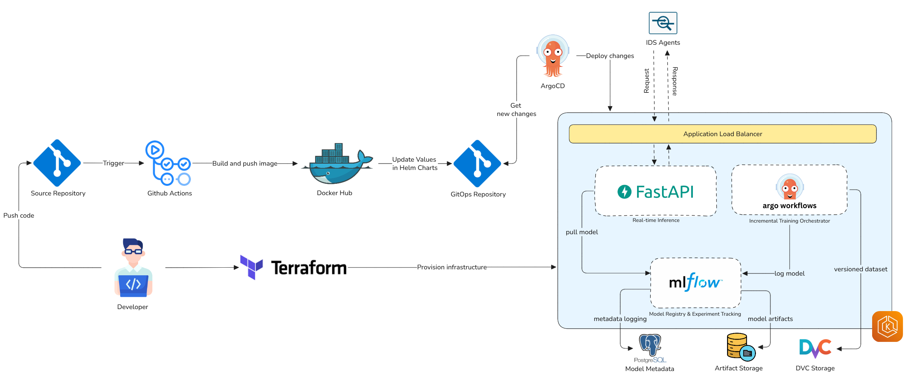
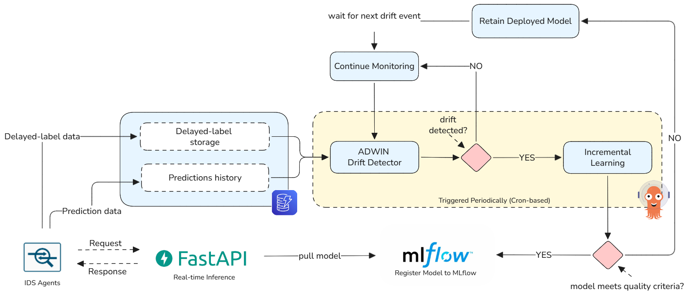
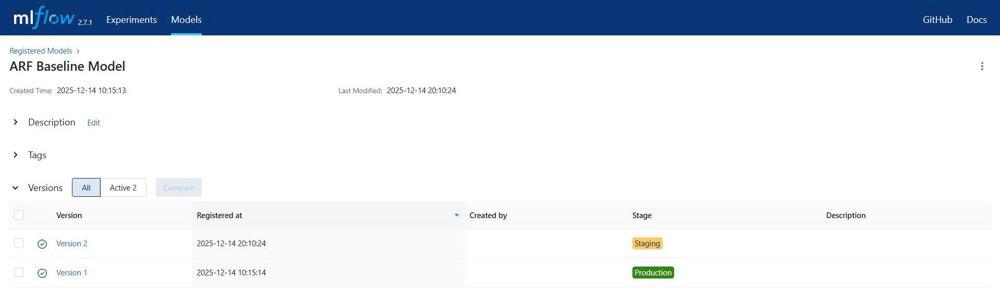
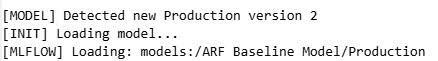
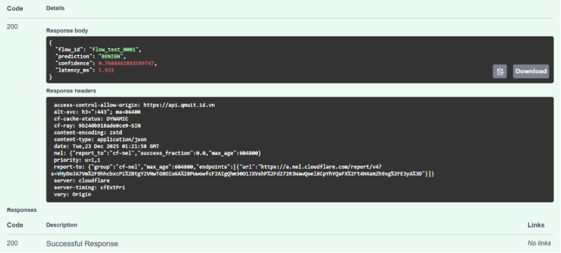
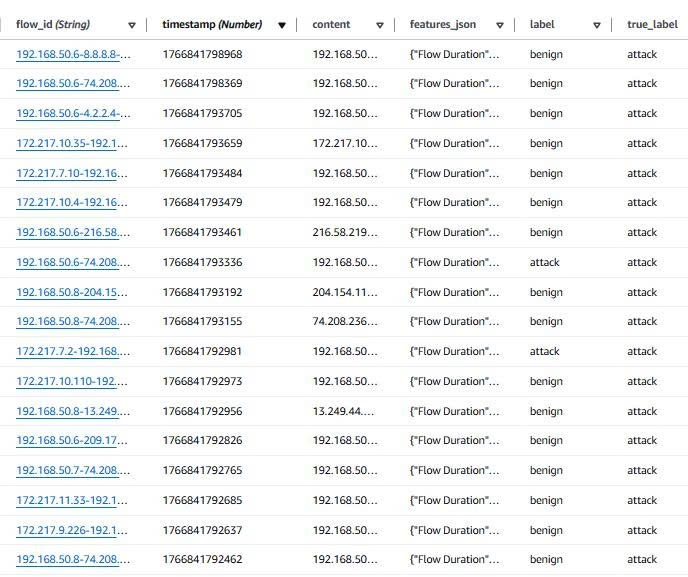
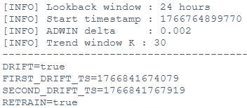
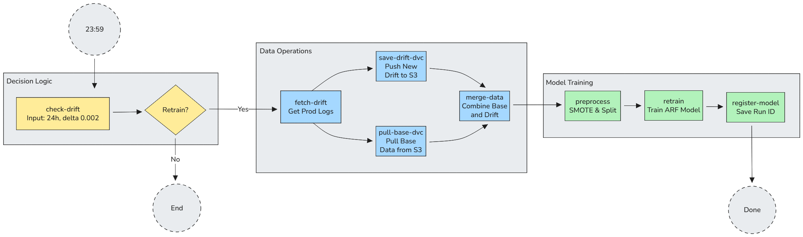
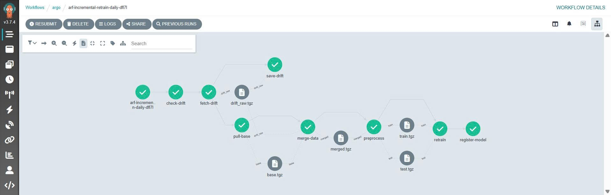
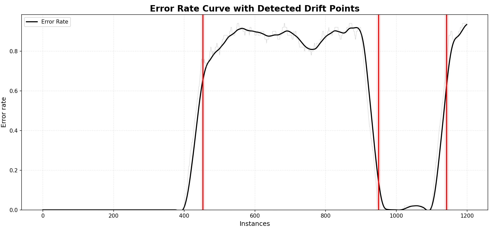

# Cloud-Ops: An application of MLOps for real-time DDoS detection with incremental learning on cloud environment

## Project Overview
The system is a **machine learning–based Network Intrusion Detection System (NIDS)** that uses the **Adaptive Random Forest (ARF)** algorithm to detect network anomalies. During training, the model employs a **Poisson distribution with parameter λ (lambda)** to determine how many times each incoming sample is used for learning (online bagging). This mechanism helps **improve learning effectiveness when the number of samples is limited** and enhances the model’s generalization ability.

The system also integrates **ADWIN (Adaptive Windowing)** for **concept drift detection**. ADWIN monitors the data stream using a **statistical threshold** to identify significant changes in the prediction error stream over time. When the detected drift exceeds the threshold, the system recognizes that a distribution shift has occurred.

Drift detection is **evaluated on a daily basis**, allowing the system to monitor changes in network behavior over time and update or adapt the model when necessary to maintain detection accuracy.

The base model is trained on CIC-DDoS2019 while CIC-IDS2017 is used to simulate concept drift scenarios.






The system consists of two independent repositories:

- **[`cloud-ops`](https://github.com/bqmxnh/cloud-ops)** (this repository) — Contains application code, ML pipelines, Docker builds, and Argo CronWorkflows  
- **[`manifests-cloud-ops`](https://github.com/bqmxnh/manifests-cloud-ops)** — Contains Helm charts, Kubernetes manifests, and Infrastructure as Code (GitOps)


## Repository Structure

### Core Directories

```
cloud-ops/
├── api/                          # FastAPI service for real-time inference
│   ├── app/
│   │   ├── main.py              # Application entry point with startup hooks
│   │   ├── inference.py         # Prediction endpoints (/predict)
│   │   ├── model_loader.py      # MLflow registry integration and auto-refresh worker
│   │   ├── metrics.py           # Prometheus metrics exposition
│   │   ├── websocket.py         # Real-time WebSocket broadcasting
│   │   ├── evaluation.py        # Model evaluation endpoints
│   │   ├── schemas.py           # Pydantic request/response schemas
│   │   ├── globals.py           # Global state management (model, scaler, encoder)
│   │   └── utils/
│   │       └── preprocess.py    # Feature normalization/scaling utilities
│   ├── Dockerfile               # Container image for API service
│   └── requirements.txt          # Python dependencies (FastAPI, river, mlflow, etc.)
│
├── retrain/                      # Model retraining pipeline components
│   ├── check_drift.py            # Drift detection logic (ADWIN + trend buffer)
│   ├── fetch_prod.py             # Retrieve labeled production data from DynamoDB
│   ├── merge_data.py             # Combine drift data with base dataset (concept-balanced strategy)
│   ├── preprocess.py             # Feature preprocessing with SMOTE oversampling
│   ├── retrain_arf.py            # Incremental model training and evaluation
│   ├── register_model.py          # MLflow registry model registration
│   ├── Dockerfile.retrain_arf    # Container image for Argo job
│   └── requirements.retrain_arf.txt  # ML pipeline dependencies (sklearn, river, mlflow, boto3, dvc)
│
├── workflows/                    # Kubernetes & Argo orchestration
│   └── retrain-workflow.yaml     # CronWorkflow definition (daily 03:00 UTC+7 execution)
│
├── datasets/                     # Data management via DVC
│   └── base/
│       ├── base.csv              # Base training dataset
│       └── base.csv.dvc          # DVC remote pointer (S3)
│
├── config/                       # Configuration templates
│   ├── env.example               # Environment variables reference
│   └── logging.yaml              # Python logging configuration
│
├── mlflow/                       # MLflow tracking & registry service
│   ├── Dockerfile                # MLflow server container
│   └── requirements.txt           # MLflow dependencies
│
└── README.md                     # This file
```

### Key Dependencies

**API Service (`api/requirements.txt`):**
- `fastapi` — Web framework for REST API
- `uvicorn` — ASGI server
- `river` — Streaming machine learning (Adaptive Random Forest)
- `scikit-learn` — Feature scaling and preprocessing
- `mlflow` — Model registry and experiment tracking
- `boto3` — AWS S3 integration
- `prometheus_client` — Metrics exposition
- `joblib` — Model serialization

**Retrain Pipeline (`retrain/requirements.retrain_arf.txt`):**
- `pandas`, `numpy` — Data manipulation
- `scikit-learn` — Feature preprocessing and evaluation metrics
- `imbalanced-learn` — SMOTE oversampling
- `river` — ARF model training
- `mlflow` — Experiment logging
- `boto3`, `s3fs` — S3 data access
- `dvc`, `dvc-s3` — Dataset versioning and retrieval

## Architecture & Data Flow

### 1. Real-Time Inference Pipeline
**Initialization Phase:**




```
app/main.py startup
  ├─ init_model()
  │  ├─ Fetch model Production version from MLflow Registry
  │  ├─ Fallback to S3 (arf-ids-model-bucket) if registry unavailable
  │  └─ Load: model.pkl, scaler.pkl, label_encoder.pkl, feature_order.pkl
  │
  └─ Start auto_refresh_worker thread (checks for model updates every CHECK_INTERVAL)
```

**Prediction Flow:**



```
POST /predict (app/inference.py)
  ├─ Parse request: FlowSchema (features as input)
  ├─ Normalize features using loaded scaler
  ├─ predict_proba_confident()
  │  ├─ Query ARF for probability from low-entropy trees only
  │  └─ Fallback to full ensemble if needed
  ├─ Decode prediction using label_encoder
  ├─ Record metrics (prediction_requests_total, prediction_latency_ms)
  └─ Return: {"flow_id", "prediction", "confidence", "latency_ms"}
```

**WebSocket Real-Time Updates:**
- Successful predictions are broadcasted to all connected WebSocket clients via `app/websocket.py`
- Model update events include version number and reload count
- Clients can subscribe to real-time prediction feed and model change notifications

**Metrics & Observability:**
- Prometheus metrics exposed at `/metrics` endpoint (app/metrics.py)
- Counters: `prediction_requests_total`, `model_reloads_total`
- Histograms: `prediction_latency_ms`
- Gauges: `model_version`, `model_reload_count`, `active_websocket_connections`


### 2. Data Collection & Labeling

**Production Data Logging:**



- Every prediction from the API is logged with metadata (flow_id, features, timestamp)
- Post-deployment labels (true_label) are collected from external sources and stored in **DynamoDB table `ids_log_system`**
- This labeled data forms the basis for drift detection and model retraining

**Dataset Management:**
- Base training dataset (`datasets/base/base.csv`) is versioned using **DVC**
- DVC remote is configured to **S3 bucket `qmuit-training-data-store`**
- `retrain/fetch_prod.py` queries DynamoDB to retrieve recent labeled samples for drift analysis


### 3. Drift Detection & Retraining Decision


**CronWorkflow Execution (Daily at 03:00 UTC+7):**




1. **Check Drift Task** (`retrain/check_drift.py`):
   - Retrieves samples with timestamp ≥ lookback window (e.g., last 24 hours)
   - Filters out samples with unknown/uncertain labels
   - Applies **ADWIN drift detector** with `delta` parameter (default: 0.002)
   - Uses **trend buffer** (size: 2000 samples) to confirm negative drift (increasing error rate)
   - Outputs:
     - `DRIFT=true/false` — Whether drift is detected
     - `DRIFT_TYPE=negative/...` — Type of drift
     - `FIRST_DRIFT_TS=<timestamp>` — When drift started
   - Exit codes determine whether to proceed with retraining

2. **Cooldown Mechanism:**
   - Prevents excessive retraining by checking `S3://qmuit-training-data-store/cooldown/last_retrain_ts.txt`
   - Ensures minimum interval between retraining cycles
   - Automatically updated when retrain pipeline completes successfully


### 4. Model Retraining Pipeline (Argo CronWorkflow)






The complete retraining workflow executes the following sequential tasks:

**Task 1: fetch-drift**
- Triggered only if `check-drift` returns `retrain=true`
- Executes `retrain/fetch_prod.py`:
  - Queries DynamoDB for up to 400 samples from `FIRST_DRIFT_TS` onward
  - Saves to container path `/data/drift_raw.csv`
  - Prepares artifact for downstream tasks

**Task 2: save-drift-dvc**
- Initializes DVC in container (no-scm mode)
- Copies drift data to `datasets/drift/drift_<timestamp>.csv`
- Executes `dvc add` and `dvc push` to archive drift data to S3 remote
- Maintains historical record of all detected drift samples

**Task 3: pull-base**
- Uses DVC to pull `datasets/base/base.csv` from S3 remote
- Ensures consistent base dataset version across training runs

**Task 4: merge-data** (`retrain/merge_data.py`)
- Combines drift and base datasets using **concept-balanced strategy**:
  - Drift samples serve as anchor (100%)
  - Adds proportional benign and attack samples from base dataset
  - Assigns `Source=DRIFT` or `Source=BASE` label for traceability
- Output: Merged dataset for training

**Task 5: preprocess** (`retrain/preprocess.py`)
- Performs stratified train/test split (default: 80/20)
- Applies **SMOTE oversampling** to training set (handles class imbalance)
- Generates outputs:
  - `train_smote.csv` — Balanced training data
  - `test_holdout.csv` — Hold-out test set

**Task 6: retrain** (`retrain/retrain_arf.py`)
- Loads current Production model from MLflow Registry and creates a baseline snapshot for comparison
- Incremental training configuration:
  - `add_ratio=0.4` — Adds 40% new trees to existing ensemble (optional)
  - Uses original feature scaler for consistency
  - Trains on preprocessed balanced dataset
- Evaluation metrics computed on hold-out test set:
  - **NEW model**: F1-Score and Cohen's Kappa on trained model
  - **PROD model**: F1-Score and Cohen's Kappa on production baseline snapshot (for comparison)
  - Calculates gains: `F1_gain = F1_new - F1_prod` and `Kappa_gain = Kappa_new - Kappa_prod`
- Results logged to MLflow run (`arf-incremental-retrain`)
- **Promotion Decision**: If F1_new > F1_prod AND Kappa_new > Kappa_prod (relative improvement):
  - Writes `promote=true` to `/tmp/promote`
  - Updates cooldown timestamp in S3
  - If promotion not approved: `promote=false`

**Task 7: register-model** (`retrain/register_model.py`)
- Triggered only if `promote=true`
- Creates new model version in MLflow Registry ("ARF Baseline Model")
- Sets stage to **Staging** (archives previous versions)
- Prepares for manual or automated promotion to Production


## Monitoring

### Prometheus Metrics
- **prediction_requests_total** — Total predictions served
- **prediction_latency_ms** — Prediction response time histogram
- **model_version** — Current model version in production
- **model_reload_total** — Number of times model was reloaded

## Experimental Results

### Concept Drift Evaluation Scenario

To evaluate the effectiveness of the proposed incremental learning mechanism, we design a **two-stage evaluation scenario**.

**Stage 1 — Base Model Training**

The base model is initially trained on approximately **1.6 million samples** from the **CIC-DDoS2019 dataset**.  
This stage represents the **original network traffic distribution**, allowing the model to learn stable attack and benign traffic patterns before deployment.

**Stage 2 — Drift Adaptation Test**

To simulate **concept drift**, samples from the **CIC-IDS2017 dataset** are introduced as a new data stream.  
Instead of using a large dataset, the experiment intentionally limits the drift data to **500 samples** in order to evaluate **how quickly the model can adapt under limited data conditions**.




During this stage:

- The model performs **online prediction for each incoming sample**
- The **ADWIN drift detector** monitors the **prediction error stream**
- When drift is detected, **incremental learning is triggered**
- The model updates its ensemble without retraining from scratch

This setup allows us to measure how well different streaming models can **retain previous knowledge while adapting to new attack patterns with only a small number of samples**.

---

### Incremental Learning Performance Comparison

| Model | Retention (%) | Forgetting (%) | Adaptation (%) |
|------|---------------|---------------|---------------|
| KNN | 93.90 | 6.10 | 26.02 |
| HAT | 88.96 | 11.04 | 20.05 |
| **ARF (Proposed Model)** | **98.79** | **1.21** | **77.30** |

---

### Observation

- **ARF achieves the highest retention (98.79%)**, indicating strong capability in preserving previously learned knowledge.
- **Forgetting is minimal (1.21%)**, demonstrating strong resistance to catastrophic forgetting.
- **Adaptation performance (77.30%) significantly outperforms KNN and HAT**, showing that ARF adapts effectively even when only **500 drift samples** are available.

These results confirm that **Adaptive Random Forest is highly suitable for incremental learning in real-time DDoS detection systems**, particularly in environments where new attack patterns may appear with limited labeled data.

## References

- **River Documentation:** [https://riverml.xyz/](https://riverml.xyz/) (Adaptive Random Forest, ADWIN)
- **MLflow Documentation:** [https://mlflow.org/](https://mlflow.org/)
- **DVC Documentation:** [https://dvc.org/](https://dvc.org/)
- **Argo Workflows:** [https://argoproj.github.io/workflows/](https://argoproj.github.io/workflows/)
- **Kubernetes:** [https://kubernetes.io/](https://kubernetes.io/)
- **FastAPI:** [https://fastapi.tiangolo.com/](https://fastapi.tiangolo.com/)


